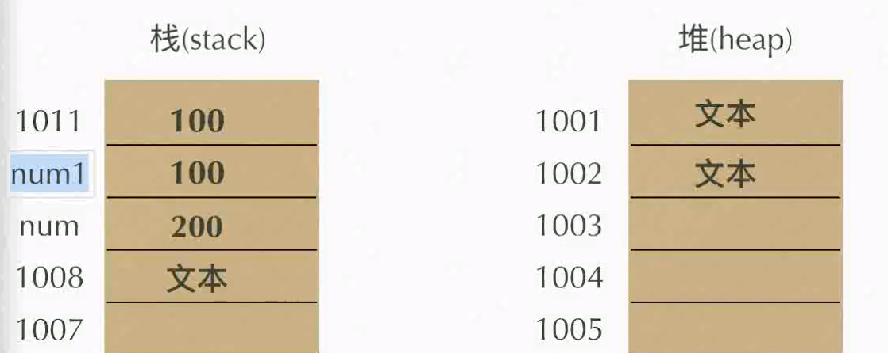
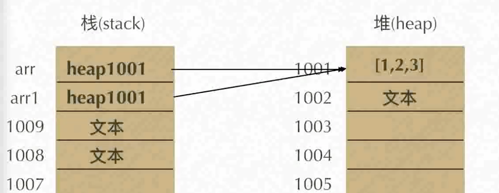
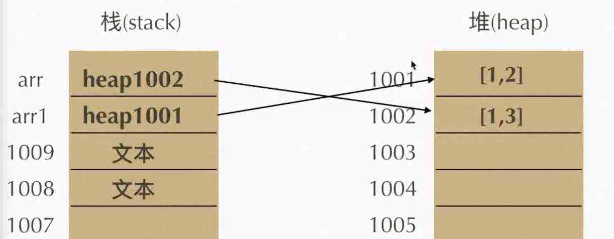

# JavaScript:

**历史**：js曾是Netscape Navigator浏览器的一部分首次出现于1996年，最初设计目的是改善用户浏览网页的体验。

**作者**：Brendan Eich

期初js名为LiveScript，后与Sun公司合作，改名JavaScript，之后Sun被Oracle收购，js版权归Oracle所有。

### **浏览器的组成：**

**shell**：用户能操作的部分，eg：设置，edit，help等；

**内核**：看不到的，能够处理代码，并把代码结果运算和显示出来的就是内核。（运行能力）

* 渲染引擎（语法规则和渲染）：即绘制，根据HTML和CSS语法的识别，类似3D，帧频16ms；
* js引擎：负责JavaScript；
* 其他引擎：负责异步等。

**Chrome浏览器**优化js引擎，命名为**V8**，直接把js转化为用机器码来执行，速度极快。

**Firefox3.5** TraceMonkey（对频繁执行的代码做了路径优化）

**Firefox4.0** leagerMonkey

**主流浏览器：**IE，Chrome，Firefox，Opera，Safari等（必须有独立研发的内核才能算）。

| 主流浏览器 |     内核     |
| :--------: | :----------: |
|     IE     |   trident    |
|   Chrome   | webkit/blink |
|  Firefox   |    Gecko     |
|   Opera    |    presto    |
|   Safari   |    webkit    |

### JS特点：

1. 解释型语言 —— 跨平台；

2. 单线程（但能呈现同步执行的运行效果）；

3. ECMA标准 —— 定义了JS的统一标准。

4. case-sensitive. 大小写敏感。所以：只有true，没有True

   ```javascript
   typeof(true);     //boolean 
   typeof(True);     //undefined
   
   typeof(-Infinity);//-Infinity
   typeof(infinity); //undefined
   ```

### JS三阶段：

原生JS叫**ECMAScript**，只能提供数组的处理等功能。

浏览器提供给js的功能，**DOM**和**BOM**。

* DOM操作文档，HTML+CSS；BOM操作浏览器。

# ECMAScript - 原生JS

### 基本语法：

1. 变量（variable）

   ```javascript
   var a;      //变量声明
   a = 100;    //赋值
   
   var a = 10, //(逗号)
       b = 20,
       c;      //同时声明多个变量
   
   //代码中的所有空格会被编译机制忽略！！！结尾用；
   ```

   * 变量命名规则：
     * 开头：英文字母、_ 、$
     * 中间：英文字母、_ 、$ 、数字
     * （不可用：关键字，保留字）

2. 值类型（Type of JavaScript）

   * 原始值（栈数据）- primitives types - **immutable** 不可改变

     * number, string, boolean, undefined, null （5种）
     * （number中包含NaN，Infinity，-Infinity三个特殊值）

   * 引用值（堆数据） - Composite data type 复合型

     * Array, object, function （3种）（没有list)

   * 定义：

     ```javascript
     var a = 123;                   //1. number
     var b = "";                    //2. string
     var c = true;                  //3. boolean (注意true、false都是小写)
     var d;                         //4. undefined.声明未赋值，typeof(d)是undefined;
     var e = null;                  //5. 占位(typeof(e)是object)
     
     var arr = [1,2,3,false,"abc"]  //6. Array，typeof(arr)是object, 使用arr.isArray来判断数组
     
     var obj = {                    //7. Object
       key  : values,//注意是逗号
       name : "xiaoliu",
       age  :  16,
       health: function(){
         age--;
       }
     }
     
     function abc(){                //8. function
       var a = 2;
  }
     ```

   * 引用值（堆数据）的特殊性：

     原始值存在栈中，数据复制/更改，都在栈中进行。

     

     而引用值（堆数据），例如arr，在栈中存放了其值[1,2]所在的堆中的地址。
   
     ```javascript
     var arr = [1,2];
     var arr1 = arr;
     arr.push(3);
  //此时arr1也变成[1,2,3]。
     ```

     
   
     ```javascript
     var arr = [1,2];
     var arr1 = arr;
     arr = [1,3];  
     //arr被重新赋值，并没有在堆中改变原值，而是在堆中以一个新的存错单元所存的值，赋值给arr，arr保留其地址。
  //所以, arr = [1,2]，而arr1 = [1,3]
     ```

     
   
     

# 基本语法：

1. 语句以“；”结束。
2. js语法错误会导致后续代码终止，但不影响其他js代码块/文件。
3. 书写规范，“=+/-”两边都有空格。
4. 函数和循环语句：

```javascript
//1. 函数
function test(){}

//2. if...else判断，condition为true时执行
if(condition){
  	statements;
}else if(condition){
  	statements;
} 

//3. while循环
while (condition){
  	statements;
}

//3.3 do...while循环，先至少执行一次，然后进行while判断和循环
do{
  	statements;
}while()

//4. switch case   
switch(n){
    case x:  //如果x与条件符合，则输出statements x。
      statements x;
      break; 
    case y:
      statements y;
      break;
    default:
      statements d;
}
//switch...case的执行会下漏，即把满足条件的语句执行完之后，把之后的语句也会执行玩，所以每一句后面要加break。

//break - "jumps out" of a loop.
//continue - "jumps over" one iteration in the loop.

//5. for循环
for (initialExpression; condition; incrementExpression){
  	statements;
}

//5.1 for...in 语句
for (variable in object) {
  	statements
}  

//5.2 for...of 语句
for (variable of object)
  	statement
//不同：for...in iterates over property names, for...of iterates over property values. 
//for...in通过属性名来迭代；for...of通过属性值来迭代。

//6.1 输入
var a = parseInt(window.prompt("input:"));
//6.2 输出
document.write(score);
console.log(score);
```

4. 数组array和对象object

```javascript
var arr = [1,2,3,"abc",undefined,null]

//利用for循环遍历arr中所有元素
for(var i=0; i<arr.length; i++){
  console.log(arr[i]);
}

var obj = {      //属性名 ：属性值,   -->用逗号隔开！
  key  : value,
	name : "deng",
  age  : 25,
  handsome : undefined,
}
//取值：
var a = obj.name;
//赋值：
obj.name = "zhang";
```

### 一、运算操作符：

* `+  -  *  /  %  =  ()`  优先级`=`最弱，`()`最高。
* `++  --`  a++，先执行语句后+1；++a，先+1后执行语句。
* ` +=  -=  /=  *=  %=`

1. `+` （自左向右）

   * 数学运算、字符串连接
   * 任何数据类型 + 字符串 = 字符串
   * 隐式类型转换：不能用`+`运算的，先number()，再运算

   ```javascript
   var a = "a"+1+1;       //a == "a11"
   var b = 1+1+"a"+1;     //b == "2a1";
   //注意！！没有字符串的+，数字优先进行运算。
   ```

2. `/`

   ```javascript
   var a = 1/0;           //a == Infinity
   var b = -1/0;          //b == -Infinity
   var c = 0/0;           //c == NaN
   var d = 1/Infinity;    //d == 0
   var e = 1/-Infinity;   //d == -0
   typeof(-0);            //number
   ```


### JS运算符：

运算必然有输出结果。

1. 比较运算符：`>  <  >=  <=  ==  !=` 输出结果为**boolean值**。

   ```javascript
   //>  <  >=  <=
   var a = "a" > "b"               //false;
   var a = "1" > "8"               //false;
   var a = "feng" > "deng"         //true; 因为"f" > "d".
   
   //== 等于
   var a = undefined == undefined; //true
   var a = Infinity == Infinity;   //true
   var a = NaN == NaN;             //false（NaN不等于任何数，包括自己）
   ```

   * `> <` ：字符串相比时，是其首字母的ascii码相比较

2. 逻辑运算符：`&&  ||  !` 输出结果为**真实值**。

   ```javascript
   //&& 且
   //左→右，依次判断，遇到false就返回该表达式的值，全为true时，返回最后一个表达式的值、或者说，是执行最后一个的表达式。
   var a = 1 && 2+2;               //4
   var a = 0 && 2+2;               //0
   
   //|| 或
   //左→右，依次判断,只要发现true，就返回该表达式的值。
   ```

   ```javascript
   //应用延伸：
   //1.用&&短路语句：
   var data = ...;
   data && fn(data) //如果data成功接收，则执行后面的function，比if写法更方便
   
   //2.用||写兼容：
   div.onclick = function(e){
     //e表示一个事件对象
     //非IE浏览器，直接用e就可以读取，但IE中，必须用window.event
     var event = e || window.event;
   }
   ```

3. 转换为boolean都是False的值：

   1. `undifined`
   2. `null`
   3. `NaN`
   4. `""`（空串）
   5. `0`
   6. `false`

### typeof()和类型转换

```javascript
typeof();                  //报错：Unexpected token ')'
typeof(123);               //1 number
typeof(true);              //2 boolean
typeof("");                //3 string
typeof(undefined);         //4 undefined
typeof(null);              //5 object
typeof([1,2,3]);           //6 object    //(array)
typeof({});                //7 object    //(object)
typeof(function(){});      //8 function  //function)
typeof(for(){});           //报错
typeof(typeof(1));         //string
```

* typeof()一共可输出6种type：number, boolean, string, undefiend, object, function.
* 1 - 5原始值，6 - 8引用值。

1. **Number(mix)** - Convert different object values to their numbers。（整个值是数字，或整体具有数字意义才可以转）

   ```javascript
   Number();               //==0      (空)
   Number(123);            //==123    (number)
   Number(-Infinity);      //==-Infinity    (number - Infinity)
   Number(NaN);            //==NaN    (number - NaN)
   Number("456");          //==456    (string是纯数字的，可以转为数字，否则NaN)
   Number("1,2,3")         //==NaN    (string，不具备数学意义)
   Number("100abc");       //==NaN    (string)
   Number("");             //==0      (string - 空串)
   Number("  ");           //==0      (string - 带空格的空串)
   Number(true);           //==1      (boolean)
   Number(undefined);      //==NaN    (未赋值)
   Number([1,2,3]);        //==NaN    (array)
   Number({});             //==NaN    (object)
   Number(null);           //==0
   Number(function(){});   //==NaN  (function)
   ```

   * 以上输出结果，typeof()都是number。

2. **parseInt(string, radix)** - 将一个字符串 string，以 radix（2-36）进制为基底，转为十进制integer。（第一个字符是number就是可以转）

   ```javascript
   parseInt();     	    	//==NaN    (空)
   parseInt(123);  	    	//==123    (number)
   parseInt(-Infinity);    //==NaN    (number - Infinity)
   parseInt(NaN);  		    //==NaN    (number - NaN)
   parseInt("456");        //==456    (string是纯数字的，可以转为数字，否则NaN)
   parseInt("100abc");     //==100    (string - 开头有数字)
   parseInt("a100bc");     //==NaN    (string - 开头无数字)
   parseInt("");           //==NaN    (string - 空串)
   parseInt(true);         //==NaN    (boolean)
   parseInt(undefined);    //==NaN    (未赋值)
   parseInt([1.9,2,3]);    //==1      (array)
   parseInt({});				    //==NaN    (object)
   parseInt(null);         //==NaN
   parseInt(function(){}); //==NaN  (function)
   ```

   * 如果radix没有，则默认开头为0x是十六进制；开头0是八进制，开头其他数字，则为十进制。
   * 如果the first character 不能 converted to a number, then return NaN。
   * 即，能转为整数的有：数字，字符串开头是数字的，array开头是数字的。看到数字位，遇到点停止。

   * parseInt向下取整。`Math.floor()`向下取整，`Math.ceil()`向上取整，`Math.round()`四舍五入取整。

3. **parseFloat(string)** - 识别到最后一个数字位，且只能识别一个点。

   ```javascript
   parseFloat("1.2.4flos");   //==1.2  typeof(a)==number
   parseFloat(-Infinity);     //==-Infinity
   parseFloat("456abc");      //==456
   parseFloat("a100bc");      //==NaN
   parseFloat([1.9,2,3]);     //==1.9
   ```

4. **String(mix)** - 把一切都转化成string

   ```javascript
   var a = String([1,2,3]);     //1,2,3
   var b = String(function(){});//function(){}
   var c = String(Infinity);    //Infinity
   var d = String(null);        //null
   var f = String();            //
   var g = String("");          //
   var demo = null + "";        //任何东西+空串，都可以返回其string形式
   ```

5. **Boolean()** - 转化成boolean

   ```javascript
   var a = Boolean([1,2,3]);     //true
   var b = Boolean(function(){});//true
   var c = Boolean(Infinity);    //true
   var d = Boolean(null);        //false
   var f = Boolean();            //false
   var g = Boolean("");          //false
   ```

6. **.toString(radix)** - 返回一个该对象的字符串，radix是目标进制。将对象以十进制转化为radix进制。

   ```javascript
   var demo = [1,2,3];
   var d = demo.toString();      //1,2,3
   
   //以下省略demo.toString():
   var demo = {};                //[object Object]
   var demo = undefiend;         //报错
   var demo = null;              //报错
   //一般用String()来做字符串操作，或+""，也可以转化为string。
   ```

   进制转换：

   ```javascript
   var a = 20;
   var b = a.toString(8);         //24(8进制)
   
   //n进制 → 十进制: parseInt(string, radix);
   //十进制 → n进制: toString(radix);
   //例：2进制 to 16进制
   var a = 10000;                 //a == 二进制10000
   var b = parseInt(a, 2);        //b == 十进制16
   var c = b.toString(16);        //c == 十六进制10
   ```

### 隐式类型转换：

1. **isNaN()** - 确定一个值是不是NaN。

   * 不是number的通过Number()转化为number，再判断。

   ```javascript
   isNaN(NaN);       // true
   isNaN(undefined); // true
   isNaN({});        // true
   
   isNaN(true);      // false
   isNaN(null);      // false
   isNaN(37);        // false
   
   // strings
   isNaN("37");      // false: 可以被转换成数值37
   isNaN("37.37");   // false: 可以被转换成数值37.37
   isNaN("37,5");    // true: 不能转化成37
   isNaN('123ABC');  // true:  parseInt("123ABC")的结果是 123, 但是Number("123ABC")结果是 NaN
   isNaN("");        // false: 空字符串被转换成0
   isNaN(" ");       // false: 包含空格的字符串被转换成0
   
   // dates
   isNaN(new Date());                // false
   isNaN(new Date().toString());     // true
   
   isNaN("blabla")   // true: "blabla"不能转换成数值
                     // 转换成数值失败， 返回NaN
   ```

2. **`++  --  +(正) -(负)`**： 先用**Number()**

3. **`+(加号)`**：左右只要有string，整个都变成string。没遇到string之前，先number()加运算，再和string相加（连接）。

4. **`-(减号) *(乘号) /(除号) %(余)`**：先**Number()**

   ```javascript
   // = - * / % ++ -- 有数字都先Number()，运算；
   //+ 碰到string的变string
   
   var a = true + 1 + "bc"; //"2bc"
   
   var a = "1" + 1;         //1
   var b = "a" * 1;         //NaN
   ```

   

5. **&& || !**：用true/false判断，结果将对应**表达式的值**返回。

6. **`> < >= <=`**：有number比较，则number优先，把两边都换成数字比；字符串则首字母ascii码比。

   ```javascript
   var a = 1 > "2";   //false,有数字，就转化成数字进行比较
   var a = "3" > "2"; //true,都是字符串，比较ascii码
   
   var a = 10 > 5 > 3;//false, 从左到右判断，10>5返回true，true==1, 1>3则为false
   ```

7. `== !==` ：也有类型转换。

   ```javascript
   var a = 1 == "1";  //true,有隐式转换
   var b = 1 == true; //true
   
   undefined > 0      //false
   undefined < 0      //false
   undefined == 0     //false
   
   null > 0           //false
   null < 0           //false
   null == 0          //false
   
   undefined == null  //true
   NaN == NaN         //false，NaN不等于任何，包括自己
   ```

8. 不发生类型转换的：绝对等于`===`和绝对不等于`!==`

9. 报错：未定义的变量进行使用——必然报错；当且仅当typeof(未定义variable)时不报错。
   * typeof(typeof(a)) == typeof("undefiend") == string
   * num.toFix(3) 意思是，把num四舍五入，小数点后保留3位有效数字。

### 函数function(){}

函数function就是，先定义方法，需要的时候使用。使用方法如下：

```javascript
function test(){
  console.log(1);
}
test();//调用函数

//1. 命名函数表达式
var test = function abc(){}
console.log(test); //==function abc(){}

//2. 匿名函数表达式
function test(){}
console.log(test.name)//=="test"

//2.1 2.2 形参与实参：
function test (a, b) {
	console.log(a+b);
} 
test(11, 12);
```

1. 如果function test内有形参：function test(a，b){}，== 隐式地在函数内申明了 var a，var b 两个变量，**()括号里面不能直接写 var**。

2. 参数可有可无，但是高级编程必须有。

   * **形参**：function test (a, b) { } 之中的a和b。可以用`test.length`求出test形参的个数。

   * **实参**：test (11, 12)；中的11和12。函数自动在`arguments`中存放每次接收的实参。

   * `arguments`不是一个[ ]array。不是！！！它还有更多其他property属性，不仅包含了一个array，还有别的属性。所以并不能用arguments.push()来改变实参列表。

   ### **天生不定参，形参可以比实参多，实参也可以比形参多。**

   * **映射：**形参和实参的数量相同的部分形成映射，改变一方，另一方也被改变。

   ```javascript
   //1. 实参多 and 用arguments查看实参列表
   function sum(a, b){
     console.log(arguments);           //arguments == [11, undefined, 3, "abc"]
     console.log(arguments.length);    //arguments.length == 4
   }
   sum(11, undefined, 3, "abc");
   
   //2. 形参多 and 用sum.length得出形参数量
   function sum(a, b, c, d){
     console.log(arguments);           //arguments == [11, 2, 3]
     console.log(sum.length);          //sum.length == 4 即，形参数量为4，而实参有3个。
     console.log(d);                   //undefined
   }
   sum(11, 2, 3);
   
   //利用“天生不定参“完成【任意个数字相加求和】。
   var res = 0;
   function sum(){
     for (i in arguments){
     	res += arguments[i];
     }
   }
   sum(2,3,4,5,1)
   console.log(res);
   
   //3. 实参arguments和函数sum()的形参相互映射机制。
   
   //3.1 实参数 = 形参数。实参、形参相互映射。在sum()函数体内改变形参a的值，实参的a也改变。
   function sum(a,b){
     // Arguments(2) [1, 2, callee: ƒ, Symbol(Symbol.iterator): ƒ]
     var a = 3;
     console.log(arguments); //实参a改变
     //--> Arguments(2) [3, 2, callee: ƒ, Symbol(Symbol.iterator): ƒ]
   }
   sum(1,2);
   
   //3.2 实参数 < 形参数。部分映射，有实参的部分映射，而实参未包含的部分不映射。
   function sum(a,b,c){
     // Arguments(2) [1, 2, callee: ƒ, Symbol(Symbol.iterator): ƒ]
     var c = 3;
     console.log(arguments); //无实参c，故不会被改变
     //--> Arguments(2) [1, 2, callee: ƒ, Symbol(Symbol.iterator): ƒ]
     
     //对arguments访问其没有的数字，不会报错，而是返回undefined
     console.log(arguments[2]);        //试图输出arguments第3位数字，得到undefined。
     console.log(arguments[8]);        //undefined
     
     //而a,b都与实参arguments有映射关系：
     var a = 4;                        //a被改变
     console.log(a,b,c,arguments);     //4,2,3,Arguments(2) [4, 2, callee: ƒ, Symbol(Symbol.iterator): ƒ]
   }
   sum(1,2);
   ```

   实参arguments，在被定义时有几个，就永远有几个。

3. Return - 返回值

   功能：1. 返回值或函数；2. 终止函数。

   如果没有写return：则系统默认返回`undefined`。

   进一步解释：return的本意是把一个值返回到函数以外，返回一个函数也一样。

### 函数的作用域

局部变量，全局变量。

JS执行三部曲：**1. 语法分析  2. 预编译  3. 解释执行**

1. **预编译之前：函数声明、变量声明提升**：预编译让函数调用在函数定义前和后都可以有效执行。
   1. 

```javascript
test(); //函数在其定义之前被调用，也能执行
function test(){
  console.log("a");
}
test(); //函数在其定义之后被调用，能执行

var a = 123;
console.log(a);   //123

console.log(a);   //undefined --> console.log()不能用
var a = 123;
```

### 对象 - Object{}

```javascript
var mrDeng = {     //【逗号】隔开
 //key : value,
	name : "deng",
  age  : 40,
  sex  : "male",
  health : 100,
	loveDrink : [],
  smoke : function(){
    mrDeng.health--; //(1)内部访问object的元素不能直接写key
  },                 //(2)也可以写this.health--; 第一人称写法
  drink : function(sth){
    this.loveDrink.push(sth);
    mrDeng.health++;
  },
}
```

0. 在object内部，用object名.key，这是第三人称表达方式；用this.key，是第一人称表达方式

1. 增、删、改、查

   ```javascript
   //1. 增，改，查
   mrDeng.wife = "xiaowu";//增，直接写mrDeng.keyname = "123";就可以增加相关属性和值。
   mrDeng.sex = "female"; //改
   
   //2. 删
   delete mrDeng.sex;
   console.log(mrDeng.sex);//undefined. 即使没有该属性，不会报错。
   
   //因为smoke的value是function：
   mrDeng.drink("water");  //执行 --> mrDeng.health==101; mrDeng.loveDrink==["water"];
                           //控制台返回undefined,因为drink函数没有返回值
   ```

2. Object创建方法：

   1. `var obj = {}`: plainObject 对象字面量/对象直接量（数组直接量，正则表达式直接量）

   2. 构造函数

      1. `new Object()`，系统自带的构造函数 - 生产一个对象；
         * 跟`Object()`类似的还有`Array()`, `Number()`也一样（数字有原始值类型数字，还有对象类型的数字）。
      2. 自定义一个构造函数

      ```javascript
      var obj = new Object(); //通过new Object()生产了一个对象，用obj接收。
      obj.name = 'obj';       //给obj增加属性，最好用‘单引号’
      obj.number = 3;
      
      //2. 自定义一个构造函数
      function Car(){
        this.name = "BMW";    //函数内: 封号结束！
        this.height = "1400";
        this.health = 100;
        this.run = function(){
          this.health--;      //这里还没有具体对象造出来，这只是生产方法，只能用this而不能用函数名Car.(跟obj的内部function不一样，obj已经是个具体对象了，这个Car()是个对象类)
        }
      }
      ```

      ```javascript
      //要让用户能够自己决定color
      function Car(color){
        this.color = color;
        ...
      }
      var car1 = new Car('green');
      var car2 = new Car('red');
      ```

      * 构造函数为什么能有效：`new`

      ```javascript
      //new == 隐式执行以下操作：
      function Car(color){
        //car1: 
        //1. var this{}; 
        //2. AO{this = {
        //				color:'green',...
        //    }}
        this.color = color;
        ...
        //AO全部被赋值；
        //3. return this;
      }
      var car1 = new Car('green'); //当new开始执行 ↑ 
      var car2 = new Car('red');
      ```

      ```javascript
      //模拟一个new的过程：
      function Person(name,height){
        var that = {};
        that.name = name;
        that.height = height;
        return that;
      }
      var person = Person("wang",180); //有效！
      //函数里已经把new的过程写了，所以不用new了。
      
      但是不要这样写！
      ```

      ```javascript
      //捣乱一下new的过程：
      function Person(name,height){
        //var this = {};
        this.name = name;
        this.height = height;
        return {};     //显式大于隐式。person1 = {}
        //return 123;  //如果return的是原始值，而不是引用值，this照样返回，person1 = {name:"wang",height:180,}
      }
      var person1 = Person("wang",180); 
      ```

   3. 数字对象，string对象，boolean对象：`new`!

      ```javascript
      //原始值：
      var n = 2;
      var s = "s";
      var b = true;
      
      //数字对象，string对象，boolean对象
      var num = new Number(123); //有对象，空属性
      var str = new String("ab"); //String对象有更多属性
      var bool = new Boolean('true'); ////有对象，空属性
      //String{"ab"} 
      //   0:"a"
      //   1:"b"
      //  lengh:2
      
      
      //它们可以有对象操作：
      num.arr = '333';   //num == Number {123, arr: '333'}
      var c = num*2;     //246        
      //数字对象参与运算后，即(num*2)是一个原始值，不具有对象性质
      ```

      `undefined`和`null`没有对象类型。

   4. 原始值：不能用属性，却可以硬加属性（只是无效而已，但不报错），也有个别方法可以用，因为**包装类**。

      ```javascript
      var num = 4;
      num.a = 3; //系统：new Number(num).a = 3; delete num.len;
      console.log(mun.len); //系统：new Number(num).a = (没给赋值)undefined; delete num.a;
      //undefined
      
      var str = "abcd";
      str.length = 2; //系统：new String(str). = 2; delete
      console.log(str.length); //系统：new String(str) == 4
      //所以，4, str == "abcd"
      ```

      String()自带一个.lengh属性。系统每次自动给原始值string建立对象再删除，造成一种我们可以使用str.lengh的假象。

      系统帮你包装，调用，然后自动替你删掉，就叫包装类。

3. 构造函数与执行函数的差别——只是一个`new`

   ```javascript
   function test(){
     console.log(123);
   }
   var a = test();       //123. a --> undefiend
   var b = new test();   //123. b --> test{} 一个test对象
   ```

### 原型

JavaScript中并没有引入类（class）的概念，但JavaScript仍然大量地使用了对象，为了保证对象之间的联系，JavaScript引入了原型与原型链的概念。

1. 定义：原型是function对象的
   1. 函数也相当于一个是一个对象
   2. 每个构造函数(constructor)都有一个原型对象(prototype),原型对象都包含一个指向构造函数的指针,而实例(instance)都包含一个指向原型对象的内部指针.

